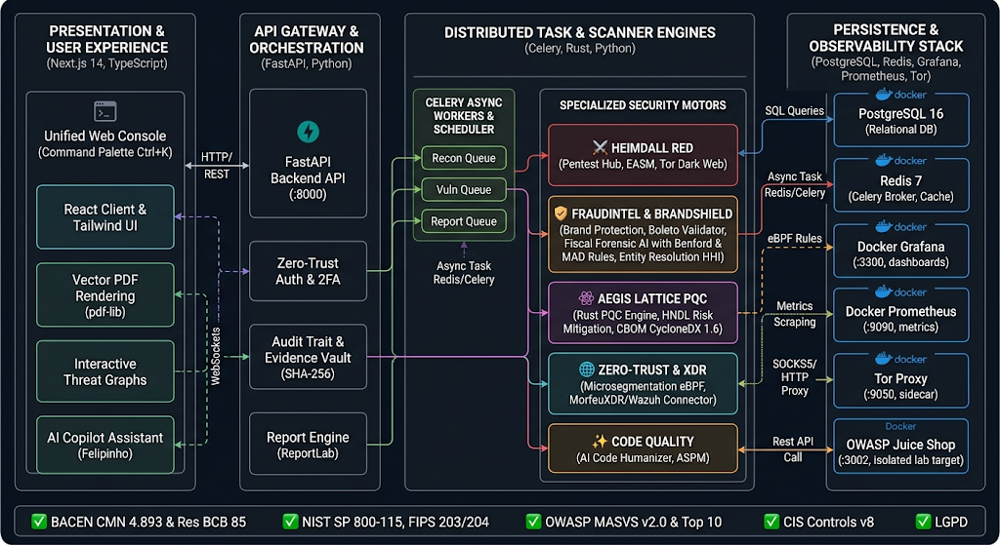

# 🛡️ HEIMDALL / morfeusec OSINT & Fiscal Forensic AI — Enterprise Cybersecurity & Forensic Audit Platform

<div align="center">


**Unified Autonomous Offensive Security Platform (Pentest / EASM / Dark Web), Fiscal & Accounting Forensic Audit (Fiscal Forensic AI), Post-Quantum Cryptography (AegisLattice PQC / CBOM), Anti-Fraud & Brand Defense (Brand Protection & Boleto / BIN Monitor), Zero-Trust Microsegmentation (eBPF / SIEM XDR), and Continuous Regulatory Governance (BACEN CMN 4.893, Res. BCB 85, ISO/IEC 27001 & NIST SP 800-115)**

[](https://fastapi.tiangolo.com)
[](https://nextjs.org/)
[](https://www.typescriptlang.org/)
[](https://www.rust-lang.org/)
[](https://csrc.nist.gov/Projects/post-quantum-cryptography)
[](https://github.com)
[](https://grafana.com)
[](https://prometheus.io)
[](https://www.bcb.gov.br)

</div>

---

## 📑 Table of Contents

1. [🌟 Executive Overview & Value Proposition](#-executive-overview--value-proposition)
2. [🏗️ System Architecture & Component Topology](#️-system-architecture--component-topology)
3. [🏛️ Functional Pillars & Platform Modules](#️-functional-pillars--platform-modules)
   - [3.1 HEIMDALL APEX™ — Executive Governance, CISO & Compliance](#31-heimdall-apex--executive-governance-ciso--compliance)
   - [3.2 HEIMDALL RED™ — Pentest Hub, EASM & Dark Web Tor Monitor](#32-heimdall-red--pentest-hub-easm--dark-web-tor-monitor)
   - [3.3 FRAUDINTEL & BRANDSHIELD™ — Brand Protection, Boletos, BIN & Fiscal Forensics](#33-fraudintel--brandshield--brand-protection-boletos-bin--fiscal-forensics)
   - [3.4 AEGIS LATTICE & SOC™ — PQC, Zero-Trust Microsegmentation & XDR](#34-aegis-lattice--soc--pqc-zero-trust-microsegmentation--xdr)
   - [3.5 HEIMDALL CODE QUALITY™ — AI Code Humanizer & ASPM](#35-heimdall-code-quality--ai-code-humanizer--aspm)
   - [3.6 AI Copilot Assistants, Audit Trail & Evidence Vault](#36-ai-copilot-assistants-audit-trail--evidence-vault)
4. [💻 Technology Stack & Docker Topology](#-technology-stack--docker-topology)
5. [📄 Reporting Engine, Technical Dossiers & PowerBI Data Mart](#-reporting-engine-technical-dossiers--powerbi-data-mart)
6. [🗺️ Complete Matrix of Frontend Routes & REST API Endpoints](#️-complete-matrix-of-frontend-routes--rest-api-endpoints)
7. [⚡ Installation & Quickstart Guide](#-installation--quickstart-guide)
   - [7.1 1-Click Local Execution (Windows)](#71-1-click-local-execution-windows)
   - [7.2 Full Execution with Docker Compose](#72-full-execution-with-docker-compose)
   - [7.3 Manual Step-by-Step Execution](#73-manual-step-by-step-execution)
   - [7.4 Cloud Deployment (AWS, GCP, Azure)](#74-cloud-deployment-aws-gcp-azure)
8. [🧪 Automated Testing & Quality Assurance](#-automated-testing--quality-assurance)
9. [📜 Regulatory Compliance & Industry Standards](#-regulatory-compliance--industry-standards)
10. [👤 Authorship, Licensing & Support](#-authorship-licensing--support)

---

## 🌟 Executive Overview & Value Proposition

**HEIMDALL / morfeusec OSINT** is an enterprise-grade cyber warfare, threat intelligence, anti-fraud defense, and forensic audit platform. Engineered for **Red Teams, SOC Analysts, AppSec Engineers, and Executive Leadership (CISO, CRO, and CFO)**, the solution consolidates six critical defense domains into a single reactive interface:

```
┌───────────────────────────────────────────────────────────────────────────────────────────────────────────┐
│                                     HEIMDALL ENTERPRISE SECURITY SUITE                                    │
├───────────────────────────────────────────────────────────────────────────────────────────────────────────┤
│                                                                                                           │
│   ┌────────────────────────┐  ┌────────────────────────┐  ┌────────────────────────┐  ┌────────────────┐  │
│   │ 🏛️ HEIMDALL APEX™      │  │ ⚔️ HEIMDALL RED™       │  │ 🛡️ FRAUDINTEL & BRAND  │  │ ⚛️ AEGIS PQC   │  │
│   │ • Executive Dashboard  │  │ • Multi-Scanner Hub    │  │ • Brand Protection     │  │ • Rust Engine  │  │
│   │ • BACEN Res. 85 / 4893 │  │ • EASM & Tor Dark Web  │  │ • Boleto & BIN Monitor │  │ • FIPS 203/204 │  │
│   │ • PowerBI Data Mart    │  │ • Mobile MASVS v2.0    │  │ • Fiscal Forensic AI   │  │ • CBOM 1.6     │  │
│   └────────────────────────┘  └────────────────────────┘  └────────────────────────┘  └────────────────┘  │
│                                                                                                           │
│   ┌────────────────────────────────────────────────────┐  ┌────────────────────────────────────────────┐  │
│   │ 🌐 ZERO-TRUST & XDR                                │  │ ✨ APPSEC & CODE QUALITY                   │  │
│   │ • Hybrid Microsegmentation (eBPF / Iptables)       │  │ • AI Code Humanizer & Refactor Engine      │  │
│   │ • MorfeuXDR & Wazuh SIEM Telemetry Connector       │  │ • ASPM Posture Gates & DevSecOps Linters   │  │
│   │ • Evidence Vault with SHA-256 Cryptographic Stamp  │  │ • Automated Backup & Quality Validation    │  │
│   └────────────────────────────────────────────────────┘  └────────────────────────────────────────────┘  │
└───────────────────────────────────────────────────────────────────────────────────────────────────────────┘
```

### Key Differentiators:
- **360° Defense Coverage**: Seamless integration from external attack surface mapping (EASM) to internal Zero-Trust microsegmentation and accounting forensic audit.
- **Post-Quantum Cryptography Readiness (PQC)**: Native Rust cryptographic engine auditing systems against *Harvest Now, Decrypt Later* (HNDL) attacks and exporting CycloneDX 1.6 Cryptographic Bill of Materials (CBOM).
- **Automated Fiscal & Forensic Audit**: Advanced statistical analytics on financial/tax records using Benford's Law, Z-Score, Herfindahl-Hirschman Index (HHI) entity resolution, and ghost company detection.
- **Client-Side Vector PDF Engine Without Blank Tabs**: Native in-memory generation via `pdf-lib` and server-side fallback with `ReportLab`, producing forensically signed dossiers with SHA-256 custody chains.

---

## 🏗️ System Architecture & Component Topology

The system adopts a **Decoupled Micro-Services, Asynchronous Event-Driven Scanner & Dockerized Observability Stack**:

```
┌───────────────────────────────────────────────────────────────────────────────────────────────────────┐
│ 1. PRESENTATION & OPERATOR EXPERIENCE (Next.js 14 App Router + React 18 + TypeScript + Tailwind CSS)   │
├───────────────────────────────────────────────────────────────────────────────────────────────────────┤
│  • Unified Web Console with Hierarchical Sidebar Navigation and Command Palette (Ctrl + K)            │
│  • Direct Client-Side Vector PDF Rendering via pdf-lib (Direct download without blank about:blank tabs)│
│  • Interactive Visual Graphs for Threat Correlation, Maltego Topology, and Microsegmentation Flows   │
│  • Integrated AI Copilot / Felipinho Assistant for Natural Language Operational Queries               │
└──────────────────────────────────┬────────────────────────────────────────────────────────────────────┘
                                   │
                    HTTP/REST / WebSockets / Proxy Rewrites
                                   │
         ┌─────────────────────────┼─────────────────────────┐
         ▼                         ▼                         ▼
┌─────────────────────────┐ ┌─────────────────────────┐ ┌─────────────────────────┐
│ 2. FASTAPI BACKEND API  │ │ 3. DOCKER GRAFANA       │ │ 4. DOCKER PROMETHEUS    │
│    (Port :8000)         │ │    (Port :3300)         │ │    (Port :9090)         │
├─────────────────────────┤ ├─────────────────────────┤ ├─────────────────────────┤
│ • Zero-Trust Auth / 2FA │ │ • SIEM / XDR Dashboards │ │ • Real-Time Scraping    │
│ • Scanner Orchestrator  │ │ • Deception Analytics   │ │ • Latency, RPS, CPU/RAM │
│ • SHA-256 Evidence Vault│ │ • iFrame Embedded Views │ │ • Scanner Metrics Ingest│
│ • Fiscal & Code Engine  │ │ • Default User: admin   │ │ • Host Metrics Collector│
└────────────┬────────────┘ └─────────────────────────┘ └─────────────────────────┘
             │
             ├──────────────────────────────────────────────┐
             ▼                                              ▼
┌─────────────────────────────────────────┐    ┌──────────────────────────────────────────┐
│ 5. CELERY ASYNC WORKERS & BEAT SCHEDULER│    │ 6. SPECIALIZED SECURITY ENGINES          │
├─────────────────────────────────────────┤    ├──────────────────────────────────────────┤
│ • Queues: default, recon, vuln, report  │    │ • AegisLattice PQC Engine (Rust Core)    │
│ • Background Scans & Cron Jobs          │    │ • Dark Web Crawler (.onion via Tor SOCKS5│
│ • Asynchronous File Processing          │    │ • Mobile SAST/DAST (APK & iOS Analyzer)  │
│ • Breach Scraping & Live CertStream     │    │ • Fiscal Forensic Engine (Benford / HHI) │
└────────────┬────────────────────────────┘    │ • AI Code Humanizer (AST Refactor Engine)│
             │                                 └──────────────────────────────────────────┘
             ▼
┌───────────────────────────────────────────────────────────────────────────────────────────────────────┐
│ 7. PERSISTENCE LAYER, CACHING, ISOLATION & SIDECAR SERVICES                                           │
├───────────────────────────────────────────────────────────────────────────────────────────────────────┤
│ • PostgreSQL 16  -> Core relational database (Findings, AuditLog, Scans, Projects, Fiscal & PQC)      │
│ • Redis 7        -> Celery message broker, DNS/CT Logs cache, and rate-limiting store                │
│ • Tor Proxy      -> Sidecar container exposing SOCKS5 (:9050) & HTTP Privoxy (:8118) for Dark Web    │
│ • OWASP Lab      -> Isolated Juice Shop container (:3002) for safe scanner validation                │
│ • Secure Storage -> Isolated storage directory for artifacts, APK/IPA uploads, and compiled reports   │
└───────────────────────────────────────────────────────────────────────────────────────────────────────┘
```

### Visual Architecture Diagram



---

## 🏛️ Functional Pillars & Platform Modules

### 3.1 HEIMDALL APEX™ — Executive Governance, CISO & Compliance

Designed for Chief Information Security Officers, internal audit departments, and corporate risk committees:

- **Executive Master Dashboard (`/dashboard`)**:
  - Consolidated view of the enterprise cyber risk posture (Cyber Risk Score scaled from 0 to 100).
  - Vulnerability distribution by severity (Critical, High, Medium, Low, Informational) with SLA tracking.
  - Real-time regulatory compliance indicators and incident timeline.
- **Tri-Pillar Strategic Governance (`/executive-governance`)**:
  - Holistic mapping across three corporate pillars: **Strategic Governance**, **Operational Security**, and **Regulatory Resilience**.
- **Grafana Cyber Analytics (`/grafana-analytics`)**:
  - 2-Tier structured views (Executive Dashboards, Threat Detection & Deception, and Prometheus Telemetry).
  - Direct integration with native Grafana and Prometheus scraping CPU, memory, and RPS every 500ms.
- **Compliance & BACEN Resolução BCB 85 / CMN 4.893 (`/compliance` and `/security-controls`)**:
  - Continuous automated audit of **32 Critical Security Controls** based on NIST SP 800-115, CIS Controls v8, and Central Bank of Brazil (BACEN) regulations.
  - Automated testing for TLS 1.3, HSTS headers, CORS Wildcards, sensitive file leaks (`.env`, `.git`), and authentication standards.
  - SHA-256 cryptographic signature and timestamping for every audited batch.
- **PowerBI REST Data Mart Connector (`/powerbi` and `PowerBIModal`)**:
  - Normalized REST endpoints (`/api/v1/powerbi/datamart`) for direct ingestion into Microsoft PowerBI Desktop and Service.

---

### 3.2 HEIMDALL RED™ — Pentest Hub, EASM & Dark Web Tor Monitor

Offensive security capabilities for Red Team operators, penetration testers, and Threat Intelligence analysts:

- **Pentest Hub Multi-Scanner (`/pentest-hub`)**:
  - Centralized orchestrator for launching, scheduling, and monitoring offensive testing tools.
  - Support for network infrastructure scanners, port discovery, service enumeration, web crawlers, SQL injection probers, SSL/TLS checkers, and endpoint fuzzers.
- **EASM & Dark Web Tor Monitor (`/easm`)**:
  - **External Attack Surface Management**: Continuous discovery of corporate domains, subdomains, CIDR blocks, exposed ports, and digital certificates.
  - **Breach & Credential Leak Monitoring**: Real-time querying against global leak intelligence databases (HaveIBeenPwned, LeakCheck, IntelX, DeHashed).
  - **Live CertStream Feed**: Live capture of newly issued TLS certificates worldwide for early detection of brand phishing domains.
  - **Dark Web Crawler (`.onion`)**: Anonymous crawling of underground forums and marketplaces routed through the Tor Proxy SOCKS5 sidecar.
- **Attack Surface Management (`/attack-surface`)**:
  - Interactive attack graph connecting perimeter assets, services, and potential lateral movement paths.
- **OSINT Recon Intelligence (`/osint`)**:
  - **Maltego Interactive Topology Graph**: Node-based visualization of subdomains, IP addresses, DNS records (A, AAAA, MX, TXT, NS, SOA, CAA), and ASN blocks.
  - Secure DNS-over-HTTPS (DoH Cloudflare/Google) resolution and Certificate Transparency logs via `crt.sh`.
  - Automated WAF and Cloud Provider fingerprinting (Cloudflare, Akamai, AWS CloudFront, Azure, GCP).
  - Automatic persistence of findings in `AuditLog` and `Finding` database tables.
- **Autonomous Mobile Pentest & Fleet Governance (`/mobile-pentest` & `/mobile-dashboard`)**:
  - Automated static (SAST) and dynamic (DAST) analysis of Android (`.apk`) and iOS (`.ipa`) application binaries.
  - Decompilation of `AndroidManifest.xml` and `Info.plist`, detecting unprotected exported activities, `usesCleartextTraffic`, and active debug flags.
  - Hardcoded secret extraction (Google, AWS, Firebase, Stripe API keys, JWT tokens).
  - Cryptographic flaw detection (DES, RC4, MD5, SHA-1, `AES/ECB`) and SSL Pinning bypass checks (`TrustAllCerts`).
  - Scorecard generation aligned with **OWASP MASVS v2.0** and CI/CD quality gate enforcement.

---

### 3.3 FRAUDINTEL & BRANDSHIELD™ — Brand Protection, Boletos, BIN & Fiscal Forensics

Proactive defense against financial fraud, brand impersonation, and tax evasion:

- **FRAUDINTEL Investigation Engine (`/fraudintel`)**:
  - Investigation hub for identifying complex fraud rings and correlating suspect entities.
- **Brand Protection & Takedown Radar (`/brand-protection`)**:
  - Autonomous typosquatting detection using Levenshtein Distance and Unicode Homoglyph substitution algorithms (IDN homograph attacks).
  - Real-time monitoring of newly registered domains, social media impersonations, and phishing landing pages.
  - Automated generation of legal-ready Takedown Dossiers (DMCA & Cease-and-Desist notices).
- **Boleto Bancário Validator & BIN Attack Monitor (`/boleto-validator`)**:
  - **Boleto Validator**: Real-time validation of Digitable Lines and Barcodes following FEBRABAN and BACEN standards, applying Modulo 10 and Modulo 11 check digit verification algorithms.
  - Bank issuer identification, currency code parsing, maturity factor calculation, and nominal amount extraction.
  - **BIN Attack Defense**: Detection of bulk card-testing brute-force attacks based on Bank Identification Numbers (BINs) with velocity rate alerting.
- **Fiscal Forensic AI & CNPJ Clone Detection (`/fiscal-forensic`)**:
  - **Smart Schema Mapping**: Ingestion and automated schema normalization for electronic invoices (NF-e, NFC-e), SPED accounting files, and spreadsheets.
  - **12+ Normative Rules Engine**: Detection of weekend invoicing, abnormal transaction hours, rounded sums, and suspicious transaction splits.
  - **Advanced Statistical Anomaly Detection**:
    - **Benford's Law**: First-digit and second-digit distribution analysis to uncover artificial manipulation in accounting ledgers.
    - **Z-Score & MAD (Median Absolute Deviation)**: Identification of statistical outliers and transaction spikes exceeding standard deviations.
    - **Entity Resolution & HHI (Herfindahl-Hirschman Index)**: Supplier concentration analysis to flag supplier favoritism, shell companies, and fake corporate registrations (CNPJ clones).
  - **Non-Accusatory Forensic AI Copilot**: Specialized assistant generating neutral, strictly factual forensic audit reports.

---

### 3.4 AEGIS LATTICE & SOC™ — PQC, Zero-Trust Microsegmentation & XDR

Deep infrastructure resilience, post-quantum crypto-agility, and endpoint observability:

- **AegisLattice Post-Quantum Crypto Defense (`/aegislattice`)**:
  - **Native Rust Cryptographic Core** (`aegislattice/`): High-performance engine for testing hybrid TLS 1.3 handshakes and auditing NIST-standardized Post-Quantum algorithms (FIPS 203 ML-KEM / Kyber and FIPS 204 ML-DSA / Dilithium).
  - **HNDL (*Harvest Now, Decrypt Later*) Risk Mitigation**: Identification of communication channels carrying long-term sensitive data protected by legacy public-key cryptography (RSA/ECC).
  - **CBOM (*Cryptographic Bill of Materials*) Orchestrator**: Generation and export of cryptographic inventories in **CycloneDX 1.6** format, detailing cipher suites, key sizes, certificates, and quantum readiness levels.
- **Zero-Trust Hybrid Microsegmentation (`/microsegmentation`)**:
  - East-West and North-South network flow visualization inspired by enterprise solutions such as Akamai Guardicore and Illumio.
  - Communication mapping between pods, containers, virtual machines, and databases.
  - Simulation and enforcement of least-privilege policies using dynamic eBPF and Iptables rules.
  - Detection of anomalous traffic deviations, unauthorized connections, and lateral movement attempts.
- **MorfeuXDR Platform & Wazuh SIEM Connector (`/morfeuxdr`)**:
  - Unified endpoint and server visibility integrating security alerts from Wazuh agents.
  - Guided step-by-step pairing wizard for deploying agents on Linux and Windows Server environments.
  - Correlation engine for system events, File Integrity Monitoring (FIM), and intrusion attempts.

---

### 3.5 HEIMDALL CODE QUALITY™ — AI Code Humanizer & ASPM

Application security, code governance, and intelligent refactoring:

- **AI Code Humanizer & Refactor Engine (`/code-humanizer`)**:
  - Static repository scanner detecting repetitive patterns, redundancies, and "AI tells" (characteristic anti-patterns produced by LLMs, such as excessive trivial comments, unnecessary `not-X-but-Y` constructs, boilerplate over-engineering, and loose types).
  - Multi-mode architectural refactoring engine (Clean, Modern, Performance, and Idiomatic).
  - **Safety Backup Subsystem**: Automated project snapshot creation with 1-click restore before any modification.
  - **Syntactic and Semantic Validator**: Continuous execution of linters and test suites to verify that original functionality is preserved.
  - Side-by-side Visual Diff Viewer (Before vs After) and readability/maintainability scorecards.
- **AppSec / ASPM Posture Gates (`/aspm`)**:
  - Code-level security posture management and dependency analysis (SCA/SAST).
  - Configurable quality gates to block CI/CD pipeline builds on critical vulnerabilities or hardcoded secrets.

---

### 3.6 AI Copilot Assistants, Audit Trail & Evidence Vault

- **AI Copilot Assistant / Felipinho (`/felipinho` & `SecurityCopilotModal`)**:
  - Enterprise security chatbot powered by LLMs (Local Ollama, OpenAI, Anthropic Claude, or Google Gemini).
  - Natural language operational command parsing (e.g., *"Audit subdomains of target.com and verify BACEN compliance"*).
  - Assistance with vulnerability triage, proof-of-concept script generation, and prioritized remediation playbooks.
- **Evidence Vault & Chain of Custody (`/evidence-vault`)**:
  - Centralized, tamper-evident repository for all test artifacts (screenshots, HTTP payloads, packet dumps, and transaction logs).
  - Instant SHA-256 cryptographic hashing at ingestion time, establishing legal non-repudiation and forensic admissibility.
- **Immutable Audit Trail (`/audit-logs`)**:
  - Tamper-resistant logging of all operator actions, scope changes, scan executions, and report downloads with timestamps and origin IP tracking.

---

## 💻 Technology Stack & Docker Topology

### Frontend
| Component | Technology | Version | Functionality |
|---|---|---|---|
| **Framework** | Next.js (App Router) | 14.2.13 | React framework with SSR, SSG, and Proxy Rewrites |
| **Language** | TypeScript | 5.6.2 | Strict static typing for all entities and data models |
| **Styling** | Tailwind CSS | 3.4.12 | Modern, responsive design system with Dark Cyber theme |
| **PDF Generation** | pdf-lib | 1.17.1 | Client-side direct binary vector PDF rendering |
| **QR Code** | qrcode | 1.5.4 | High-density 2D matrix rendering for 2FA & pairing |
| **Charts** | Recharts | 2.12.7 | Interactive radar, bar, donut, and trend graphs |
| **Icons** | Lucide React | 0.441.0 | Vector icon library |
| **Notifications** | React Hot Toast | 2.4.1 | Real-time event notifications and toast alerts |

### Backend, Scanners & Observability
| Component | Technology | Version | Functionality |
|---|---|---|---|
| **Language** | Python | 3.11+ | Core engine for analysis, automation, and API services |
| **PQC Core** | Rust | 1.75+ | High-performance AegisLattice cryptographic engine |
| **API Framework** | FastAPI | 0.110.0+ | High-throughput asynchronous REST server (Port `:8000`) |
| **ASGI Server** | Uvicorn | 0.29.0+ | Event-driven asynchronous execution |
| **ORM / Database** | SQLAlchemy & AsyncPG | 2.0+ / 0.29+ | Async relational persistence and query engine |
| **Task Queue** | Celery & Redis | 5.3+ / 7.0+ | Distributed scan execution and scheduled beat cron jobs |
| **Observability** | Grafana & Prometheus | v10.0 / v2.45 | Telemetry aggregation, SIEM metrics, and dashboards |
| **Server Reports** | ReportLab & OpenPyXL | 4.1+ / 3.1+ | Server-side PDF compilation and multi-tab `.xlsx` reports |

### Docker Port Topology & Mappings
```
 ┌──────────────────────┬─────────────────────────────┬────────────────────────────────┐
 │ Service              │ Internal -> Host Port       │ Purpose                        │
 ├──────────────────────┼─────────────────────────────┼────────────────────────────────┤
 │ Next.js Frontend     │ 3000                        │ Web Console & Operator UI      │
 │ FastAPI Backend      │ 8000                        │ API Gateway & Scanner Engine   │
 │ Grafana Server       │ 3000 -> 3300                │ Official Grafana Server        │
 │ Prometheus Server    │ 9090 -> 9090                │ Telemetry Scraping & Metrics   │
 │ PostgreSQL Database  │ 5432                        │ Relational Database Storage    │
 │ Redis Cache & Broker │ 6379                        │ Celery Task Queue & Cache      │
 │ Tor Proxy (Sidecar)  │ 9050 / 8118                 │ SOCKS5 & HTTP Privoxy Dark Web │
 │ Juice Shop (Lab)     │ 3000 -> 3002                │ Isolated Vulnerable Target Lab │
 └──────────────────────┴─────────────────────────────┴────────────────────────────────┘
```

---

## 📄 Reporting Engine, Technical Dossiers & PowerBI Data Mart

The platform implements a hybrid multi-format documentation and business intelligence architecture:

1. **Native Client-Side Vector PDF Engine (`pdf-lib`)**:
   - Compiles binary PDF documents directly within the operator's browser memory.
   - **Eliminates Blank Tabs (`about:blank`)**: Generates and downloads files as direct DOM Blob streams (`application/pdf`).
   - Comprehensive multi-page dossiers for **32 Security Controls**, **Mobile MASVS Pentest**, **EASM Recon**, and **Fiscal Forensic Audits**.
2. **Server-Side Python Engine (`ReportLab`)**:
   - Endpoint `/api/v1/security-controls/report/pdf` for programmatic generation, batch exports, and scheduled automated delivery.
3. **Advanced Audit Spreadsheets (`OpenPyXL`)**:
   - Structured `.xlsx` exports with segregated tabs: Executive Summary, Asset Inventory, Finding Details, Risk Matrix, and Technical Remediation Playbooks.
4. **PowerBI REST Data Mart (`/api/v1/powerbi`)**:
   - High-performance, pre-aggregated endpoints designed for seamless tabular ingestion in corporate BI solutions.

---

## 🗺️ Complete Matrix of Frontend Routes & REST API Endpoints

### Frontend Web Console Routes (Next.js)
| Category | Route | Description |
|---|---|---|
| **Access** | `/login` | Zero-Trust Authentication with TOTP 2FA and Dynamic QR Code |
| **Governance** | `/dashboard` | Executive Master Dashboard & Overall Cyber Risk Score |
| **Governance** | `/executive-governance` | Tri-Pillar Strategic Governance Boardroom View |
| **Governance** | `/grafana-analytics` | Grafana Cyber Analytics, Attack Graph & Prometheus |
| **Governance** | `/compliance` | Regulatory Compliance (BACEN Res. 85 / CMN 4.893) |
| **Governance** | `/security-controls` | Continuous Audit of 32 Security Controls |
| **Offensive** | `/pentest-hub` | Pentest Hub Multi-Scanner Central Console |
| **Offensive** | `/easm` | EASM, CertStream & Dark Web Tor Monitor (`.onion`) |
| **Offensive** | `/attack-surface` | Attack Surface Graph & Exposed Perimeter Assets |
| **Offensive** | `/osint` | OSINT Reconnaissance with Maltego Interactive Graph |
| **Offensive** | `/mobile-pentest` | Static/Dynamic SAST/DAST Analysis for APK & iOS |
| **Offensive** | `/mobile-dashboard` | Mobile Fleet Governance & OWASP MASVS Radar |
| **Anti-Fraud** | `/fraudintel` | FRAUDINTEL Investigation Engine |
| **Anti-Fraud** | `/brand-protection` | Brand Protection, Typosquatting & Takedown Radar |
| **Anti-Fraud** | `/fiscal-forensic` | Fiscal Forensic AI, Benford, Z-Score & CNPJ Clones |
| **Anti-Fraud** | `/boleto-validator` | Boleto Digitable Line Validator & BIN Attack Defense |
| **Defense & SOC**| `/findings` | Centralized Findings Management & SLA Tracking |
| **Defense & SOC**| `/remediation` | Prioritized Remediation Guide & Playbooks |
| **Defense & SOC**| `/evidence-vault` | Evidence Vault with SHA-256 Custody Proofs |
| **Defense & SOC**| `/correlation` | Cross-Plane Multi-Vector Risk Correlation Engine |
| **Defense & SOC**| `/aegislattice` | AegisLattice Post-Quantum Defense & CBOM Hub |
| **Defense & SOC**| `/microsegmentation`| Zero-Trust Hybrid Microsegmentation (eBPF / Iptables)|
| **Defense & SOC**| `/morfeuxdr` | MorfeuXDR SIEM & Wazuh Endpoint Integration |
| **AppSec & Code**| `/code-humanizer` | AI Code Humanizer & Enterprise Refactoring Engine |
| **AppSec & Code**| `/aspm` | AppSec / ASPM Posture Gates for DevSecOps |
| **Management** | `/projects` | Workspaces, Projects & Scope Management |
| **Management** | `/reports` | Dossier Compilation Center (PDF / Excel) |
| **Management** | `/integrations` | SIEM, Cloud Hub & Notification Webhooks |
| **Management** | `/audit-logs` | Tamper-Resistant Audit Trail for Compliance |

### Key REST API Endpoint Groups (FastAPI Backend)
| Endpoint Prefix | OpenAPI Tag | Primary Operations |
|---|---|---|
| `/api/v1/auth` | `Authentication` | Operator login, JWT token issuance/refresh, TOTP 2FA setup |
| `/api/v1/projects` | `Projects` | Workspace & project CRUD, scope association, testing targets |
| `/api/v1/scopes` | `Scope` | Authorized target registration, blacklists, rules of engagement |
| `/api/v1/scans` | `Scans` | Scan initiation, background execution, Kill Switch termination |
| `/api/v1/assets` | `Assets` | Discovered asset classification, inventory management |
| `/api/v1/findings` | `Findings` | Finding retrieval, triage, status updates, CVSS calculation |
| `/api/v1/evidence` | `Evidence` | Evidence upload, download, and SHA-256 integrity verification |
| `/api/v1/reports` | `Reports` | Technical and executive report compilation in PDF/XLSX |
| `/api/v1/audit-logs` | `Audit` | System audit trail querying and filtering |
| `/api/v1/osint` | `OSINT Reconnaissance` | DoH resolution, CT Log querying, WAF fingerprinting |
| `/api/v1/mobile-pentest` | `Mobile Pentest` | APK/IPA binary uploads, manifest parsing, secret extraction |
| `/api/v1/security-controls`| `Security Controls` | 32 BACEN/NIST control execution & PDF report compilation |
| `/api/v1/pentest-hub` | `Pentest Hub` | Multi-scanner trigger, tool orchestration, and result aggregation |
| `/api/v1/easm` | `EASM & Dark Web` | Attack surface scans, CertStream feeds, `.onion` queries |
| `/api/v1/aegis` | `AegisLattice PQC` | PQC handshake audits, HNDL risk analysis, CBOM generation |
| `/api/v1/brand` | `Brand Protection` | Typosquatting algorithms, homoglyph detection, takedown kits |
| `/api/v1/boleto` | `Boleto Bancário` | Digitable line validation, Modulo 10/11, bank code lookups |
| `/api/v1/bin-monitor` | `BIN Attack Defense` | Bulk card-testing velocity tracking and rate-alerting |
| `/api/v1/fiscal` | `Fiscal Forensic AI` | Benford analysis, Z-Score/MAD, HHI, and non-accusatory Copilot |
| `/api/v1/code-humanizer` | `Code Humanizer` | AI tell detection, AST refactoring, automated project backups |
| `/api/v1/microsegmentation`| `Microsegmentation` | Traffic flow telemetry, Zero-Trust policies, eBPF rules |
| `/api/v1/morfeuxdr` | `MorfeuXDR` | Wazuh agent pairing, log ingestion, and SIEM correlation |
| `/api/v1/grafana-analytics`| `Grafana & Honeypots`| Deception honeypot telemetry ingestion and SIEM metrics |
| `/api/v1/powerbi` | `PowerBI Analytics` | Normalized tabular endpoints for PowerBI consumption |
| `/api/v1/felipinho` | `Felipinho AI` | Natural language queries with the AI Security Copilot |

---

## ⚡ Installation & Quickstart Guide

### 7.1 1-Click Local Execution (Windows)

To launch the full platform immediately on Windows:

1. Double-click the [`RODAR_TUDO.bat`](file:///c:/Users/loren/Documents/code_felipe/pentest/RODAR_TUDO.bat) file (or execute via Command Prompt / PowerShell):

```cmd
.\RODAR_TUDO.bat
```

> **Automated Steps Executed by the Script:**
> - Verifies local Node.js and Python installations.
> - Automatically runs `npm install` for the frontend and sets up the Python virtual environment (`.venv`).
> - Spawns the FastAPI Backend (`:8000`) and the Next.js Frontend (`:3000`).
> - Automatically opens your default browser at `http://localhost:3000`.

---

### 7.2 Full Execution with Docker Compose

Recommended for enterprise evaluation, staging, and production environments:

```bash
# 1. Clone the repository
git clone https://github.com/felipemor/morfeu-OSINT.git
cd morfeu-OSINT

# 2. Configure environment variables (if needed)
cp .env.example .env

# 3. Build and launch all orchestrated containers
docker compose up -d --build
```

**Service Access Points:**
- **Operator Web Console**: [`http://localhost:3000`](http://localhost:3000)
- **Interactive OpenAPI / Swagger Docs**: [`http://localhost:8000/docs`](http://localhost:8000/docs)
- **Official Grafana Server**: [`http://localhost:3300`](http://localhost:3300) (*admin* / *changeme_grafana*)
- **Prometheus Telemetry Explorer**: [`http://localhost:9090`](http://localhost:9090)
- **Isolated OWASP Juice Shop Lab Target**: [`http://localhost:3002`](http://localhost:3002)

---

### 7.3 Manual Step-by-Step Execution

#### 1. Backend & Scanners (Python 3.11+)
```bash
cd backend
python -m venv .venv

# Windows:
.venv\Scripts\activate
# Linux/macOS:
source .venv/bin/activate

pip install -r requirements.txt
uvicorn app.main:app --host 0.0.0.0 --port 8000 --reload
```

#### 2. Frontend (Node.js 18+ / npm)
```bash
cd frontend
npm install
npm run dev
```

---

### 7.4 Cloud Deployment (AWS, GCP, Azure)

- **AWS (ECS Fargate / App Runner)**: Build and publish container images to Amazon ECR, deploying backend and frontend with an Application Load Balancer (ALB) and Amazon RDS PostgreSQL.
- **GCP (Cloud Run / GKE)**: Push container images to Google Artifact Registry and deploy serverless services via Cloud Run with Cloud SQL.
- **Azure (Container Apps / AKS)**: Deploy onto Azure Container Apps backed by Azure Database for PostgreSQL.

---

## 🧪 Automated Testing & Quality Assurance

Unit and integration test suites validate analyzer integrity and API functionality:

```bash
# Run backend test suite
cd backend
python -m pytest tests -vv

# Validate frontend linting and production build
cd frontend
npm run lint
npm run build
```

---

## 📜 Regulatory Compliance & Industry Standards

The platform is designed and maintained in strict compliance with the following international frameworks:

- **BACEN Resolução CMN nº 4.893 & Resolução BCB nº 85**: Cybersecurity policy and cloud computing compliance for financial institutions.
- **NIST SP 800-115**: *Technical Guide to Information Security Testing and Assessment*.
- **NIST FIPS 203 / FIPS 204**: Standardized Post-Quantum Cryptographic Algorithms (ML-KEM and ML-DSA).
- **OWASP MASVS v2.0**: *Mobile Application Security Verification Standard*.
- **OWASP Web & API Top 10**: Proactive validation against modern application security risks.
- **CIS Controls v8**: *Center for Internet Security Critical Security Controls*.
- **LGPD / GDPR**: Secure data handling, confidentiality, and tamper-resistant auditability.

---

## 👤 Authorship, Licensing & Support

<div align="center">

**HEIMDALL / morfeusec OSINT** © 2026. All rights reserved.

Developed by **Felipe Costa** — Offensive Security Specialist, Threat Intelligence Engineer, AppSec & Mobile Security Architect.

📫 **Contact**: [`felipe_c@myyahoo.com`](mailto:felipe_c@myyahoo.com)

Distributed under the **MIT License**. See [`LICENSE`](file:///c:/Users/loren/Documents/code_felipe/pentest/LICENSE) for details.

</div>
