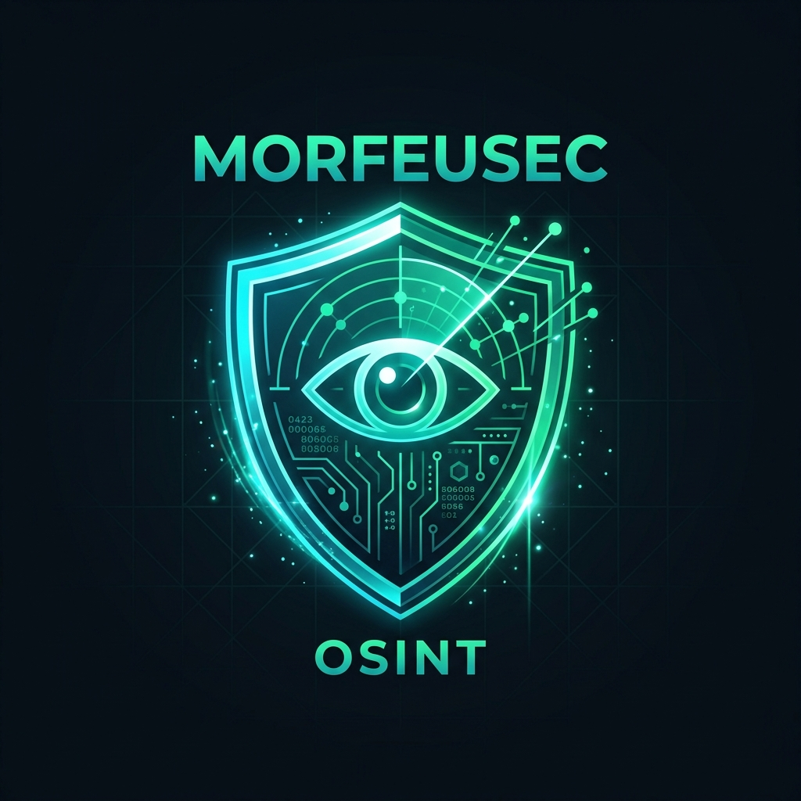

# 🛡️ morfeusec OSINT — Enterprise Offensive Intelligence & Autonomous Pentesting Platform

<div align="center">



**Plataforma Integrada de Reconhecimento de Perímetro (OSINT), Mobile Pentest Autônomo (OWASP MASVS v2.0), Central Grafana Analytics & Telemetria, MorfeuXDR (Wazuh/eBPF) e Validação Contínua de Controles de Segurança (BACEN CMN 4.893 & NIST SP 800-115)**

[](https://fastapi.tiangolo.com)
[](https://nextjs.org/)
[](https://www.typescriptlang.org/)
[](https://grafana.com)
[](https://prometheus.io)
[](https://tailwindcss.com/)
[](https://python.org)
[](https://docker.com)
[](https://mas.owasp.org/MASVS/)
[](https://www.bcb.gov.br)

</div>

---

## 📑 Sumário

1. [🌟 Visão Geral Executiva](#-visão-geral-executiva)
2. [🏗️ Arquitetura Completa da Aplicação](#️-arquitetura-completa-da-aplicação)
3. [💻 Stack Tecnológica & Topologia Docker](#-stack-tecnológica--topologia-docker)
4. [🚀 Módulos e Funcionalidades](#-módulos-e-funcionalidades)
   - [🔐 Autenticação Zero-Trust, 2FA e QR Code](#1--autenticação-zero-trust-2fa-e-qr-code)
   - [📈 Central Executiva Grafana Analytics & Telemetria](#2--central-executiva-grafana-analytics--telemetria)
   - [🌐 Reconhecimento de Perímetro OSINT (Maltego Visual Engine)](#3--reconhecimento-de-perímetro-osint-maltego-visual-engine)
   - [📱 Autonomous Mobile Pentest & Fleet Governance](#4--autonomous-mobile-pentest--fleet-governance)
   - [🛡️ MorfeuXDR, Microsegmentação e Deception Honeypot](#5-️-morfeuxdr-microsegmentação-e-deception-honeypot)
   - [🔒 32 Controles de Segurança & BACEN CMN 4.893](#6--32-controles-de-segurança--bacen-cmn-4893)
5. [📄 Motor de Relatórios & Laudos Técnicos em PDF](#-motor-de-relatórios--laudos-técnicos-em-pdf)
6. [🗺️ Mapa de Rotas e Endpoints da API](#️-mapa-de-rotas-e-endpoints-da-api)
7. [⚡ Guia de Instalação e Execução](#-guia-de-instalação-e-execução)
8. [📜 Normas e Conformidade Regulatória](#-normas-e-conformidade-regulatória)
9. [👤 Autoria e Créditos](#-autoria-e-créditos)

---

## 🌟 Visão Geral Executiva

O **morfeusec OSINT** é uma plataforma corporativa de segurança ofensiva, Deception Technology e gestão contínua de exposição a ameaças (*Continuous Threat Exposure Management - CTEM*). Foi concebida para atender tanto às auditorias de segurança de alto rigor (**Big4: PwC, Deloitte, EY, KPMG**, reguladores financeiros **BACEN / CVM**) quanto aos padrões de experiência e interface de produtos de tecnologia de ponta (**Google Security & Microsoft Defender**).

A plataforma consolida em uma única suíte:
- **Central Grafana Analytics & Telemetria**: Hub unificado de dashboards correlacionando métricas de infraestrutura, Deception Honeypot, grafo de vetores de ataque e telemetria Prometheus em tempo real (500ms).
- **Inteligência de Superfície de Ataque (EASM / OSINT)** em estilo Maltego interativo com auto-persistência em `AuditLog` e registro automático em `Finding`.
- **SIEM/XDR MorfeuXDR & Microsegmentação eBPF Zero Trust**: Integração com agentes Wazuh e políticas dinâmicas de microsegmentação de rede.
- **Deception Honeypot Remoto**: Módulo de engodo instalado em servidores externos que reporta indicadores de compromisso (IoCs) diretamente para a console via API ingestora `POST /api/v1/grafana-analytics/honeypot/report`.
- **Auditoria Estática e Dinâmica Autônoma de Aplicativos Móveis (Android APK & iOS IPA)** sob as diretrizes do **OWASP MASVS v2.0**.
- **Validação Automatizada de 32 Controles Críticos de Segurança** alinhados à **Resolução CMN nº 4.893 do BACEN**, **NIST SP 800-115** e **CIS Controls v8**.
- **Emissão Automatizada de Laudos Executivos e Técnicos em PDF Vetorial** e planilhas de auditoria multi-abas (`.xlsx`).

---

## 🏗️ Arquitetura Completa da Aplicação

A arquitetura do **morfeusec OSINT** adota o padrão **Decoupled Micro-Services, Dockerized Observability & Asynchronous Event-Driven Scanner Architecture**, garantindo isolamento de contexto, alta performance e geração confiável de artefatos de segurança.

```
┌───────────────────────────────────────────────────────────────────────────────────────────────────────┐
│                                          morfeusec OSINT                                              │
│                                 ENTERPRISE OFFENSIVE SECURITY PLATFORM                                 │
└──────────────────────────────────┬────────────────────────────────────────────────────────────────────┘
                                   │
                                   ▼
┌───────────────────────────────────────────────────────────────────────────────────────────────────────┐
│ 1. APRESENTAÇÃO & INTERFACE (Next.js 14 App Router + TypeScript + Tailwind CSS)                       │
├───────────────────────────────────────────────────────────────────────────────────────────────────────┤
│ • /login              -> Autenticação Zero-Trust (TOTP 2FA + QR Code 2D Escaneável + Biometria)       │
│ • /grafana-analytics  -> Central Unificada de Telemetria (Dashboards, Attack Graph, Honeypot, Prometheus) │
│ • /osint              -> Reconhecimento de Perímetro (Maltego Graph, DoH, CT Logs, AuditLog, Findings)│
│ • /morfeuxdr          -> SIEM/XDR Corporativo (Guia Wazuh, Correlação de Eventos e Agentes)           │
│ • /microsegmentation  -> Microsegmentação eBPF Hybrid Zero Trust (Políticas e Isolamento de Rede)      │
│ • /mobile-dashboard   -> Governança de Frotas Mobile (Fleet Threat Index, Radar MASVS, CI/CD Gates)   │
│ • /mobile-pentest     -> Análise SAST/DAST de Binários Android (.apk) e iOS (.ipa)                    │
│ • /security-controls  -> Auditoria dos 32 Controles BACEN CMN 4.893 & NIST SP 800-115                 │
│ • /attack-surface     -> Grafo Interativo de Ativos de Perímetro e Correlação de Vulnerabilidades     │
│ • /reports            -> Central de Emissão de Dossiês Multi-Formato (PDF Vetorial, Excel .xlsx)      │
│ ───────────────────────────────────────────────────────────────────────────────────────────────────── │
│ • Client PDF Engine   -> pdf-lib (Geração direta de PDF vetorial binário sem abas em branco)          │
│ • QR Code Engine      -> qrcode (Matriz 2D padrão ECC-M legível por iPhone, Android Lens e 2FA Apps)  │
└──────────────────────────────────┬────────────────────────────────────────────────────────────────────┘
                                   │
                    HTTP/REST / WebSockets / Proxy Rewrites
                                   │
        ┌──────────────────────────┼──────────────────────────┐
        ▼                          ▼                          ▼
┌────────────────────────┐ ┌────────────────────────┐ ┌────────────────────────┐
│ 2. FASTAPI BACKEND API │ │ 3. DOCKER GRAFANA      │ │ 4. DOCKER PROMETHEUS   │
│    (Porta :8000)       │ │    (Porta :3300)       │ │    (Porta :9090)       │
├────────────────────────┤ ├────────────────────────┤ ├────────────────────────┤
│ • Auth & Session JWT   │ │ • Server Grafana v10   │ │ • Metrics Collector    │
│ • Ingestor Honeypot    │ │ • Embeddable Dashboards│ │ • Live Polling 500ms   │
│ • AuditLog & Findings  │ │ • Enterprise Analytics │ │ • Target Scraping      │
│ • ReportLab PDF Engine │ │ • User/Pass: admin     │ │ • Host Metrics Engine  │
└───────────┬────────────┘ └────────────────────────┘ └────────────────────────┘
            │
            ▼
┌───────────────────────────────────────────────────────────────────────────────────────────────────────┐
│ 5. MOTORES ESPECIALIZADOS DE VARREDURA & INTELIGÊNCIA                                                  │
├───────────────────────────────────────────────────────────────────────────────────────────────────────┤
│ • Motor OSINT Perímetro  -> DNS DoH, crt.sh CT Logs, Fingerprint WAF, Google Dorks, Cloud Hunter       │
│ • Motor Mobile SAST      -> AndroidManifest, Info.plist, Extrator de Segredos, SSL Pinning, MASVS     │
│ • 32 Controles BACEN     -> TLS 1.3/HSTS, Audit CORS Wildcard, File Leak Scanner, Carimbo SHA-256     │
│ • Ingestor Remote Deception-> POST /api/v1/grafana-analytics/honeypot/report (Servidores Remotos)    │
└──────────────────────────────────┬────────────────────────────────────────────────────────────────────┘
                                   │
                                   ▼
┌───────────────────────────────────────────────────────────────────────────────────────────────────────┐
│ 6. CAMADA DE PERSISTÊNCIA, CACHE E ARTEFATOS                                                          │
├───────────────────────────────────────────────────────────────────────────────────────────────────────┤
│ • PostgreSQL 16  -> Banco relacional (AuditLog, Finding, Usuários, Projetos, Auditorias)             │
│ • Redis 7        -> Fila de tarefas assíncronas, cache de requisições DNS/CT Logs e controle de taxa   │
│ • File Storage   -> Armazenamento temporário seguro para upload de binários .apk/.ipa e laudos gerados│
└───────────────────────────────────────────────────────────────────────────────────────────────────────┘
```

---

## 💻 Stack Tecnológica & Topologia Docker

### Frontend (Interface & Experiência do Operador)
| Tecnologia | Versão | Função na Aplicação |
|---|---|---|
| **Next.js** | 14.2.13 | Framework React com App Router, SSR/SSG e Proxy Rewrites |
| **React** | 18.3.1 | Biblioteca de construção da interface reativa |
| **TypeScript** | 5.6.2 | Tipagem estática rigorosa para todas as entidades e modelos |
| **Tailwind CSS** | 3.4.12 | Sistema de design corporativo responsivo e tema Dark Cyber |
| **pdf-lib** | 1.17.1 | Geração cliente nativa de laudos executivos e técnicos em PDF vetorial |
| **qrcode** | 1.5.4 | Renderizador de matrizes QR Code 2D de alta densidade |
| **Recharts** | 2.12.7 | Gráficos dinâmicos de radar, barras, roscas e tendências temporais |
| **Lucide React** | 0.441.0 | Ícones vetoriais modernos de segurança e operações |
| **React Hot Toast** | 2.4.1 | Notificações dinâmicas de eventos de varredura e ingestão |

### Backend, Scanners & Observabilidade
| Tecnologia | Versão | Função na Aplicação |
|---|---|---|
| **Python** | 3.11+ | Linguagem central de análise e automação ofensiva |
| **FastAPI** | 0.110.0+ | Framework web assíncrono de altíssima performance (Porta `:8000`) |
| **Grafana Server** | Docker v10 | Servidor de análise visual e dashboards de SIEM/XDR (Porta `:3300`) |
| **Prometheus** | Docker v2.45 | Motor de monitoramento e scraping de métricas (Porta `:9090`) |
| **Uvicorn** | 0.29.0+ | Servidor ASGI de produção para concorrência assíncrona |
| **HTTPX / Requests** | 0.27+ | Requisições HTTP/2 assíncronas para probers de segurança |
| **DNS-Python** | 2.6+ | Consultas DNS-over-HTTPS (DoH) e enumeração assíncrona de zonas |
| **ReportLab / OpenPyXL** | 4.1+ / 3.1+ | Compilação de laudos em PDF server-side e planilhas `.xlsx` |

### Topologia Mapeada de Portas Docker & Serviços
```
 ┌──────────────────────┬─────────────────────────────┬────────────────────────────────┐
 │ Serviço              │ Porta Interna -> Hospedeiro │ Finalidade                      │
 ├──────────────────────┼─────────────────────────────┼────────────────────────────────┤
 │ Next.js Frontend     │ 3000                        │ App Web Router & Console UI    │
 │ FastAPI Backend      │ 8000                        │ API Gateway & Scanner Engine   │
 │ Grafana Server       │ 3000 -> 3300                │ Painel Grafana Official Server │
 │ Prometheus Server    │ 9090 -> 9090                │ Telemetria & Coleta de Métricas│
 │ PostgreSQL Database  │ 5432                        │ Persistência Relacional SQL    │
 │ Redis Cache          │ 6379                        │ Fila Assíncrona & Cache DNS    │
 └──────────────────────┴─────────────────────────────┴────────────────────────────────┘
```

---

## 🚀 Módulos e Funcionalidades

### 1. 🔐 Autenticação Zero-Trust, 2FA e QR Code
- **Credenciais Corporativas + TOTP 2FA**:
  - Validação estrita de e-mail corporativo e credenciais.
  - Campo com 6 caixas individuais para o código 2FA Authenticator com suporte a digitação sequencial, foco automático e colagem de código (*clipboard paste*).
  - Preenchimento rápido de teste com um clique (`492817`).
- **QR Code 2D Escaneável por Celulares**:
  - Matriz 2D gerada dinamicamente via biblioteca `qrcode` com alto contraste sobre fundo branco.
  - **100% legível instantaneamente** por câmeras de iPhone (iOS), Google Lens (Android), Câmeras Samsung, WhatsApp e apps de 2FA.
  - **Seletor de Modo de Leitura**:
    1. *📷 Câmera do Celular / Lens*: URL HTTPS com Session ID dinâmico e PIN temporário.
    2. *🔑 Google / Microsoft Authenticator*: URI padrão `otpauth://totp/...` para importação direta no aplicativo.
  - Temporizador regressivo de **60 segundos** com expiração visual automática.
  - **Bloqueio Estrito de Bypass**: Validação do PIN de 6 dígitos antes de permitir o acesso.

---

### 2. 📈 Central Executiva Grafana Analytics & Telemetria (`/grafana-analytics`)

Organizada em uma arquitetura limpa de **2 níveis (3 Abas Principais + Sub-abas por Tema)**:

#### Aba 1: 📊 Dashboards Executivos
- **Visão Executiva (CISO & SOC)**: Resumo consolidado da saúde da infraestrutura, volume de ameaças bloqueadas, incidentes críticos e distribuição por severidade.
- **Mobile MASVS Analytics**: Métricas de conformidade dos aplicativos móveis da frota (iOS/Android).
- **Painel Oficial Grafana**: Botão interativo que abre diretamente a instância oficial do servidor Grafana em `http://localhost:3300` (credenciais predefinidas `admin` / `changeme_grafana`).

#### Aba 2: ⚔️ Detecção de Ameaças & Deception
- **Attack Graph Correlator**: Grafo interativo visualizador de vetores de ataque que correlaciona vulnerabilidades críticas de borda com potenciais caminhos de movimento lateral.
- **Honeypot & Instalação Remota**:
  - **Transparência de Dados**: Painel explicitando exatamente de onde vem os logs e alertas de Deception.
  - **Guia Passo a Passo de Deploy Remoto**: Instruções detalhadas para instalação do container Honeypot em qualquer servidor Linux/Cloud externo.
  - **Scripts Prontos Copy-Paste**: Comandos Bash e Docker `curl` prontos para deploy com envio automático de telemetry via API `POST /api/v1/grafana-analytics/honeypot/report`.

#### Aba 3: ⚙️ Telemetria & Automação
- **Prometheus Explorer**: Coleta contínua em tempo real (intervalo de 500ms) conectada diretamente ao servidor Prometheus (`http://localhost:9090`), exibindo utilização de CPU, RAM e requisições/segundo.
- **Regras de Correlação**: Regras ativas SIEM/XDR que correlacionam falhas de autenticação, eventos eBPF e alertas de Honeypot.

---

### 3. 🌐 Reconhecimento de Perímetro OSINT (Maltego Visual Engine) (`/osint`)
- **Maltego Interactive Topology Graph**: Grafo visualizador interativo em estilo Maltego para explorar nós de subdomínios, IPs, servidores DNS, registros MX e certificados digitais.
- **DNS Zone Intelligence & DoH**: Resolução segura via DNS-over-HTTPS (Cloudflare / Google) para registros `A`, `AAAA`, `MX`, `TXT`, `NS`, `CAA` e `SOA`.
- **Certificate Transparency (CT Logs)**: Descoberta automatizada de subdomínios ativos e históricos consultando a base global `crt.sh` e certificados TLS/SANs.
- **Identificação de ASN, Nuvem e WAF**: Identificação de Akamai Edge, Cloudflare, AWS CloudFront, Azure e Google Cloud.
- **Auto-Persistência em AuditLog & Findings**:
  - Toda execução de varredura grava automaticamente uma entrada auditável na tabela `AuditLog`.
  - Riscos e vulnerabilidades descobertas no perímetro são auto-registrados como achados na tabela `Finding`.

---

### 4. 📱 Autonomous Mobile Pentest & Fleet Governance (`/mobile-pentest` e `/mobile-dashboard`)
- **Análise Autônoma de APK (Android) & IPA (iOS)**: Auditores de `AndroidManifest.xml` e `Info.plist`, detecção de atividades exportadas sem permissão e `usesCleartextTraffic`.
- **Extrator de Segredos e Chaves Hardcoded**: Identificação de API Keys (Google, AWS, Firebase, Stripe, JWT).
- **Auditoria Criptográfica & Network Security**: Análise de cifras obsoletas (`AES/ECB`, MD5, SHA-1) e bypass de SSL Pinning (`TrustAllCerts`).
- **Fleet Governance & CI/CD Gates**: Pontuação de risco por domínio OWASP MASVS v2.0 com portões de aprovação para esteiras de CI/CD.

---

### 5. 🛡️ MorfeuXDR, Microsegmentação e Deception Honeypot (`/morfeuxdr` e `/microsegmentation`)
- **MorfeuXDR SIEM/XDR**: Central de visibilidade Wazuh integrando alertas de endpoint, eventos de sistema e correlação de ameaças. Passo a passo intuitivo de pareamento de agentes Linux/Windows.
- **Microsegmentação eBPF Hybrid Zero Trust**: Motor de isolamento dinâmico de rede com controle granular de tráfego entre pods/containers e aplicação de políticas de privilégio mínimo.

---

### 6. 🔒 32 Controles de Segurança & BACEN CMN 4.893 (`/security-controls`)
- Auditoria contínua e automatizada de 32 pontos de controle de segurança baseados no **NIST SP 800-115**, **BACEN CMN 4.893** e **CIS Controls**.
- Validação TLS 1.3/HSTS, auditoria de CORS Wildcard (`*`), verificação de vazamento de arquivos `.env`/`.git` e assinatura criptográfica SHA-256 de cada lote testado.

---

## 📄 Motor de Relatórios & Laudos Técnicos em PDF

A plataforma conta com uma **arquitetura de relatórios híbrida de alta fidelidade**:

1. **Geração Vetorial Nativa no Cliente (`pdf-lib`)**:
   - Compilação binária de documentos PDF vetoriais diretamente no navegador do operador.
   - **Eliminação de abas em branco (`about:blank`)**: O download é acionado diretamente como stream de blob DOM (`application/pdf`).
   - Dossiê técnico completo de 3 páginas para os **32 Controles de Segurança** com tabela de conformidade, sumário executivo, matriz de risco e carimbo SHA-256.
   - Dossiê completo para **Mobile Pentest** cobrindo conformidade **OWASP MASVS v2.0**.
2. **Fallback e Geração no Backend (`ReportLab`)**:
   - Endpoint Python `/api/v1/security-controls/report/pdf` com geração server-side multi-páginas e estilos corporativos.
3. **Planilhas de Auditoria Excel (`OpenPyXL`)**:
   - Exportação em formato `.xlsx` com múltiplas abas estruturadas, contendo evidências técnicas, status de conformidade e recomendações para desenvolvedores.

---

## 🗺️ Mapa de Rotas e Endpoints da API

### Rotas do Frontend (Next.js):
| Rota | Descrição |
|---|---|
| `/login` | Autenticação com Credenciais + 2FA TOTP e QR Code Mobile |
| `/grafana-analytics` | Central Executiva Grafana Analytics, Attack Graph, Honeypot & Prometheus |
| `/osint` | Reconhecimento de Perímetro OSINT com Maltego Interactive Graph |
| `/morfeuxdr` | MorfeuXDR (SIEM/XDR com Wazuh, Alertas e Passo a Passo de Agentes) |
| `/microsegmentation` | Microsegmentação eBPF Hybrid Zero Trust & Isolamento de Tráfego |
| `/dashboard` | Painel Executivo Principal e Threat Intelligence Posture |
| `/mobile-dashboard` | Governança de Frotas Mobile, Radar MASVS e CI/CD Gates |
| `/mobile-pentest` | Upload e Análise SAST/DAST de Aplicativos Android e iOS |
| `/security-controls` | Auditoria dos 32 Controles BACEN/CIS e Emissão de Laudos |
| `/attack-surface` | Mapeamento de Ativos e Grafo de Vulnerabilidades |
| `/reports` | Central de Documentos e Dossiês Gerados |
| `/projects` | Gestão de Escopos e Projetos de Pentest |
| `/audit-logs` | Trilha de Auditoria e Logs de Eventos da Plataforma |

### Principais Endpoints da API (FastAPI Backend):
| Método | Endpoint | Descrição |
|---|---|---|
| `POST` | `/api/v1/auth/login` | Autenticação de operador e emissão de sessão JWT |
| `POST` | `/api/v1/osint/scan` | Execução de varredura OSINT com auto-log no `AuditLog` e `Finding` |
| `POST` | `/api/v1/grafana-analytics/honeypot/report` | Ingestão pública de telemetria e IoCs de Honeypots remotos |
| `GET`  | `/api/v1/grafana-analytics/metrics` | Métricas consolidadas do Prometheus e Grafana |
| `POST` | `/api/v1/security-controls/test-all` | Execução da bateria completa dos 32 controles BACEN/NIST |
| `POST` | `/api/v1/security-controls/report/pdf` | Geração server-side do Laudo Técnico em PDF |
| `GET`  | `/api/v1/projects` | Listagem de projetos e escopos cadastrados |
| `GET`  | `/docs` | Documentação interativa Swagger / OpenAPI 3.0 |

---

## ⚡ Guia de Instalação e Execução

### Opção 1: Inicialização Rápida com Docker Compose (Recomendado)

```bash
# Clone o repositório
git clone https://github.com/felipemor/morfeu-OSINT.git
cd morfeu-OSINT

# Suba todos os containers (Backend, Frontend, Grafana Server, Prometheus, Postgres, Redis)
docker compose up -d --build
```

Acesse no navegador:
- **Console Frontend**: [`http://localhost:3000`](http://localhost:3000)
- **Servidor Grafana**: [`http://localhost:3300`](http://localhost:3300) (Login: `admin` / `changeme_grafana`)
- **Prometheus Server**: [`http://localhost:9090`](http://localhost:9090)
- **API Backend FastAPI**: [`http://localhost:8000`](http://localhost:8000)
- **Swagger OpenAPI Docs**: [`http://localhost:8000/docs`](http://localhost:8000/docs)

---

### Opção 2: Inicialização Local no Windows (Scripts Rápidos)

A raiz do projeto conta com arquivos de inicialização automatizada:

1. **Iniciar Backend & Scanners**:
   - Dê um duplo clique em [`start_scanner.bat`](file:///c:/Users/loren/Documents/code_felipe/pentest/start_scanner.bat) (inicia FastAPI na porta `8000`).
2. **Iniciar Frontend Next.js**:
   - Dê um duplo clique em [`start.bat`](file:///c:/Users/loren/Documents/code_felipe/pentest/start.bat) (inicia Next.js na porta `3000`).

---

### Opção 3: Execução Manual (Passo a Passo)

#### 1. Backend / Scanner (Python 3.11+):
```bash
cd scanner
# (Ou cd backend)
python -m venv venv
venv\Scripts\activate
pip install -r requirements.txt
python main.py
```
*O backend estará rodando em `http://localhost:8000`.*

#### 2. Frontend (Node.js 18+):
```bash
cd frontend
npm install
npm run dev
```
*O frontend estará rodando em `http://localhost:3000`.*

---

## 🧪 Testes Automatizados

O repositório possui uma suíte de testes unitários e de integração para validar a integridade dos analisadores de segurança:

```bash
cd backend
python -m pytest tests -vv
```

---

## 📜 Normas e Conformidade Regulatória

O **morfeusec OSINT** foi estruturado em estrita conformidade com os seguintes padrões internacionais:

- **OWASP MASVS v2.0** (*Mobile Application Security Verification Standard*)
- **OWASP Mobile Top 10 & Web Top 10**
- **BACEN Resolução CMN nº 4.893 & Resolução BCB nº 85** (Diretrizes de Segurança Cibernética no SFN)
- **NIST SP 800-115** (*Technical Guide to Information Security Testing and Assessment*)
- **CIS Controls v8** (*Center for Internet Security Critical Security Controls*)
- **LGPD** (*Lei Geral de Proteção de Dados - Lei nº 13.709/2018*)

---

## 👤 Autoria e Créditos

<div align="center">

**morfeusec OSINT** © 2026. Todos os direitos reservados.

Desenvolvido por **Felipe Costa** — Especialista em Segurança Ofensiva, Inteligência de Ameaças e Mobile Application Security.

📫 **Contato**: [`fsec.costa@gmail.com`](mailto:fsec.costa@gmail.com)

</div>
